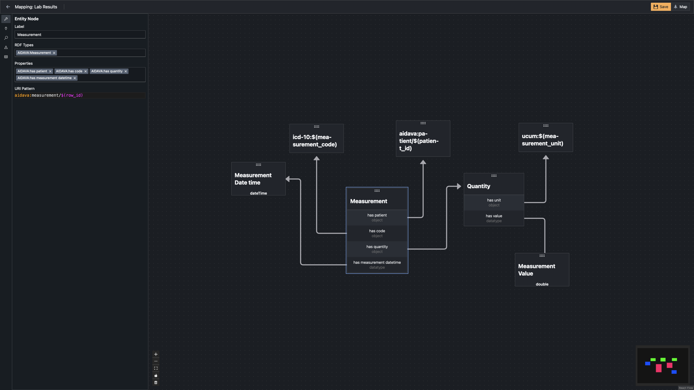

# RDF Craft Test

Your goal is to achieve the following mapping:

## General Information

- You can use RDFCraft documentation to help you:
  [HERE](maastrichtu-ids.github.io/RDFCraft/)

- Resulting RDF file is in [output.ttl](output.ttl)

- You can find the ontology that needs to be used in the
  [aidava-sphn.ttl](aidava-sphn.ttl) file.

  - Base uri for the ontology is `https://biomedit.ch/rdf/sphn-ontology/AIDAVA/`

- In my mapping I have used following prefixes

  - aidava: `https://rdf.aidava.eu/resource/`
    - For all generated resources
  - icd-10: `https://biomedit.ch/rdf/sphn-resource/icd-10-gm/`
    - For ICD-10 codes
  - ucum: `https://biomedit.ch/rdf/sphn-resource/ucum/`
    - For all UCUM units

- You can find the data that needs to be used in the
  [measurements.csv](measurements.csv) file.

- You can also find the export of the mapping in the
  [export.tar.gz](export.tar.gz) file.
  - You still need create a workspace and add ontology and prefixes to it.

## High Level Instructions

1. Create a Workspace in RDFCraft
2. Add the ontology to the workspace
3. Add the prefixes to the workspace
4. Create a new mapping
5. Start mapping the data!
